# 대한민국 명절 교통사고 데이터 — 설날 vs 추석, 어떤 연휴가 더 위험할까?

> Streamlit + MySQL 기반 명절 연휴 교통사고 분석 대시보드
> 설날·추석 연휴기간 사고통계(2021\~2025)와 연휴기간 사고다발지역(2021\~2025)을 한 화면에서 비교합니다.

SKN37기 4조 · 팀 프로젝트

## 목차

1. [프로젝트 개요](#1-프로젝트-개요)
2. [프로젝트 기간](#2-프로젝트-기간)
3. [프로젝트 팀 및 역할](#3-프로젝트-팀-및-역할)
4. [기술 스택](#4-기술-스택)
5. [필수 라이브러리](#5-필수-라이브러리)
6. [데이터베이스 설계문서 ERD](#6-데이터베이스-설계문서-erd)
    - [6.1 테이블 설명](#61-테이블-설명)
    - [6.2 설계 포인트](#62-설계-포인트)
7. [수집 데이터](#7-수집-데이터)
    - [7.1 수집 데이터 목록](#71-수집-데이터-목록)
    - [7.2 데이터 출처](#72-데이터-출처)
    - [7.3 어떻게 수집했는지](#73-어떻게-수집했는지)
    - [7.4 데이터 활용 검증](#74-데이터-활용-검증-db-적재-후-재계산)
    - [7.5 FAQ 데이터 구성](#75-faq-데이터-구성)
8. [데이터 조회 프로그램 화면설계서](#8-데이터-조회-프로그램-화면설계서)
    - [8.1 전체 레이아웃](#81-전체-레이아웃)
    - [8.2 사이드바 사양](#82-사이드바-사양)
    - [8.3 탭별 화면 설계](#83-탭별-화면-설계)
9. [FAQ 조회 시스템](#9-faq-조회-시스템)
10. [구현 화면과 기능](#10-구현-화면과-기능)
    - [10.1 전체 비교 탭](#101-전체-비교-탭)
    - [10.2 연도 상세 탭](#102-연도-상세-탭)
    - [10.3 사고다발지점 탭](#103-사고다발지점-탭)
11. [회고록](#11-회고록)

---

## 1. 프로젝트 개요

명절 연휴에는 이동이 한꺼번에 몰리면서 교통사고가 집중됩니다. 이 프로젝트는 "설날과 추석 중 어느 쪽이 더 위험한가"를 같은 축에서 데이터로 비교합니다.

- 목표: 설날·추석 연휴의 사고 건수·사망자·부상자·중상자를 같은 기준으로 비교하고, 위험한 날짜와 지역을 함께 제시합니다.
- 범위: 2021\~2025년 연휴 10회, 총 36일 (설날 17일 + 추석 19일) · 사고 12,948건 · 사망 190명 · 부상 22,142명
- 결론: **추석이 일평균 사고 기준 27.4% 더 위험** (설날 314.2건/일 vs 추석 400.4건/일)

## 2. 프로젝트 기간

| 구분 | 기간 |
|---|---|
| 프로젝트 시작 | 2026-09-27 (일) |
| 프로젝트 마감 | 2026-09-28 (월) |
| 총 기간 | 2일 |

## 3. 프로젝트 팀 및 역할

SKN37기 4조

| 이름 | 역할 | 담당 |
|---|---|---|
| 문진호 | 팀장 / 화면 설계·구현 | Streamlit 화면 구성, 카드·차트 구현, 데이터 연동, 최종 발표 |
| 국경민 | 기획 | 주제 선정과 범위 정의, 데이터 정의서·화면 시나리오, 데이터 활용 기준 판단 |
| 김신형 | 데이터 수집 | 연휴 사고통계 수집·정제, 데이터 검증 |
| 윤혜정 | 데이터 수집 | 사고다발지역 수집, FAQ 크롤링·정제 |
| 전윤호 | 데이터 수집 | 차량 등록·이륜차 데이터 수집, FAQ 전처리 |

<!-- 담당자별 세부 업무 범위는 팀 확정 후 수정하세요. -->

## 4. 기술 스택

| 구분 | 사용 기술 |
|---|---|
| 언어 | Python 3.10+ (PEP 604 타입 힌트 `dict \| None` 사용) |
| 웹 화면 | Streamlit (`st.tabs`, `st.segmented_control`, `st.toggle`, `st.cache_data`) |
| 데이터 처리 | pandas |
| 시각화 | Plotly (`graph_objects`, `make_subplots`), 한국 행정구역 경계 GeoJSON |
| 데이터베이스 | MySQL 5.7 이상 (JSON 타입 사용), InnoDB · utf8mb4 / utf8mb4_unicode_ci |
| DB 접속 | PyMySQL |
| 개발 환경 | VS Code, Git / GitHub |

## 5. 필수 라이브러리

`requirements.txt` 기준입니다. (아래 목록은 업로드된 소스의 `import` 문에서 확인한 것입니다.)

| 라이브러리 | 용도 | 사용 위치 |
|---|---|---|
| streamlit | 화면·탭·필터 위젯 | app.py, sections.py, faq.py |
| pandas | CSV/DB 표 처리, 집계 | analysis.py, data_source.py, sections.py, faq.py |
| plotly | 막대·꺾은선·지도 차트 | sections.py |
| pymysql | MySQL 연결 (순수 파이썬 드라이버) | data_source.py |

```text
streamlit>=1.40
pandas
plotly
pymysql
```

- `st.segmented_control` · `st.toggle`을 쓰므로 **Streamlit 1.40 이상**이 필요합니다.
- Python 표준 라이브러리만 사용하는 모듈: `json`, `dataclasses`, `pathlib`, `html`, `re`
- 프로젝트에는 위 4개 외에 `analysis.py`(계산), `sections.py`(화면 카드), `theme.py`(색·CSS), `faq.py`(FAQ 화면), `data_source.py`(데이터 로딩), `db_config.py`(접속 정보) 모듈이 함께 있습니다.
- `theme.py`는 화면 색·글꼴·CSS(`T.CSS`, `T.FAQ_CSS`, `T.COLORS`, `T.TINTS`, `T.MUTED`)을 담당합니다. **이번 전달본에는 포함되지 않았으므로 저장소에 반드시 함께 올려야 실행됩니다.**

## 6. 데이터베이스 설계문서 ERD

`db/holiday_db.sql`(MySQL Workbench에서 실행)로 만들어지는 스키마입니다. 테이블 5개 + 뷰 3개로 구성되며, 물리 외래키(FK) 없이 `year`·`holiday`·`sido`·`sigungu` 값으로 논리 조인합니다.

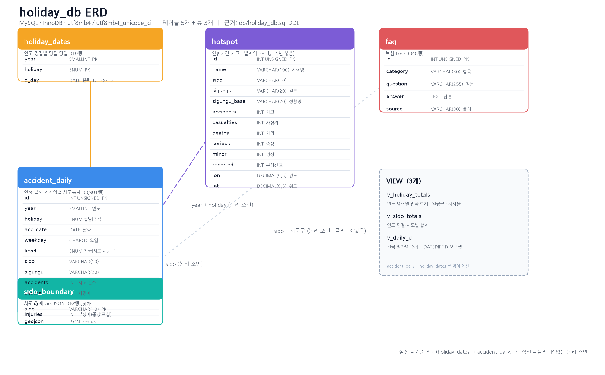

### 6.1 테이블 설명

| 테이블 | 행 수 | 설명 | 주요 키·제약 |
|---|---|---|---|
| accident_daily | 8,901 | 연휴 날짜 × 지역별 사고통계. `level`로 전국·시도·시군구를 구분 | PK `id`, UNIQUE `(acc_date, holiday, sido, sigungu)`, INDEX `(year, holiday, level)` |
| holiday_dates | 10 | 연도·명절별 명절 당일. 일자별 D 계산 기준 | PK `(year, holiday)` |
| hotspot | 81 | 연휴기간 사고다발지역(21\~25년 합산, 5년 묶음). 좌표 포함 | PK `id`, INDEX `(sido, sigungu_base)` |
| sido_boundary | 17 | 지도 배경용 | PK `sido` |
| faq | 348 | 보험 FAQ. 답변 끝의 `(출처 : 보험사)`를 별도 컬럼으로 분리 | PK `id`, INDEX `category`, `source` |

### 6.2 설계 포인트

1. `level` 컬럼 하나로 전국 합계·시도 소계·시군구 원자료를 한 테이블에 담아, 화면에서 집계 단위를 골라 쓸 수 있게 했습니다.
2. `injuries`(부상자)에 `serious`(중상자)가 **포함**되어 있습니다. 부상과 중상을 더하면 이중계상이므로 화면에서도 합산하지 않습니다.
3. `hotspot`에 `sigungu`(원본 표기)와 `sigungu_base`(사고통계와 맞춘 이름)를 따로 두어, 원본을 훼손하지 않고 조인만 정합하게 맞췄습니다.
4. 데이터 중복 적재를 막으려고 `accident_daily`에 `UNIQUE (acc_date, holiday, sido, sigungu)`를 걸었습니다.
5. 스크립트는 `DROP TABLE`/`DROP VIEW` 후 다시 만들기 때문에 몇 번을 실행해도 같은 상태가 됩니다.

## 7. 수집 데이터

### 7.1 수집 데이터 목록

| 구분 | 데이터 | 형식 | 규모 | 활용 |
|---|---|---|---|---|
| 사고통계 | 설날·추석 연휴기간 사고통계(2021\~2025) | CSV → 테이블 | 8,901행 | 대시보드 전체 |
| 명절 기준일 | 연도·명절별 명절 당일 | 테이블 | 10행 | D-day 계산 |
| 사고다발지역 | 연휴기간 사고다발지역(2021\~2025) | CSV → 테이블 | 81곳 | 사고다발지점 탭 |
| 지도 경계 | 시도 경계 GeoJSON | JSON → 테이블 | 17개 | 지도 배경 |
| FAQ | 보험사 자동차·운전자 보험 FAQ | 크롤링 CSV → 테이블 | 348건 | 보험 FAQ 화면 |
| 참고 | 데이터 인용 가이드(DataFact) | 링크 | 1건 | 출처 표기 형식 |

### 7.2 데이터 출처

| 데이터 | 출처 |
|---|---|
| 설날·추석 연휴기간 사고통계(2021\~2025) | 도로교통공단 (TAAS, https://taas.koroad.or.kr/) |
| 연휴기간 사고다발지역(2021\~2025) | 도로교통공단 |
| 보험 FAQ | AXA · 삼성화재 · 하나손해보험 · KB손해보험 고객센터 FAQ |
| 인용 표기 형식 | 팀 DataFact 데이터 인용 가이드 |

출처 표기는 화면 하단 캡션에 함께 넣었습니다: "출처: 도로교통공단, 설날·추석 연휴기간 사고통계(2021\~2025), 연휴기간 사고다발지역(2021\~2025)."

### 7.3 어떻게 수집했는지

| 데이터 | 수집 방법 | 비고 |
|---|---|---|
| 사고통계 | 도로교통공단 설날·추석 연휴기간 사고통계를 연도별로 내려받아 연도·명절·날짜·시도·시군구 단위로 정리 | 지역 필터용 전국/시도/시군구 3계층 행(`level`) 생성, 연휴 일수 보정용 날짜별 행 유지 |
| 명절 기준일 | 음력 1월 1일·8월 15일에 해당하는 양력 날짜를 연도별로 정리해 `holiday_dates`에 적재 | 연휴 일자를 D-1/D/D+1로 나누는 기준 |
| 사고다발지역 | 연휴기간 사고다발지역 5년 묶음 자료에서 지점명·좌표·사고·사상자·사망·중상·경상·부상신고를 수집 | 원본 시군구 표기 유지 + 사고통계와 맞춘 `sigungu_base` 별도 관리 |
| 보험 FAQ | 보험사 고객센터 FAQ를 크롤링해 `항목 / 질문 / 답변 / 출처` 4개 컬럼으로 정리 | 답변 끝 `(출처 : 보험사)`를 정규식으로 분리, 깨진 HTML 엔티티(예: `& #39;` 형태)만 복원 |
| DB 적재 | `db/build_mysql.py`가 `data/` 폴더를 읽어 `db/holiday_db.sql` 생성 → Workbench에서 실행 | DB·테이블·데이터·뷰를 한 번에 생성 |
| 폴백 구조 | MySQL 연결 실패 시 `data/` 폴더 CSV로 자동 전환하고 사이드바에 사유 표시 | 시연 중 DB 장애에도 화면이 멈추지 않게 한 장치 |

### 7.4 데이터 활용 검증 (DB 적재 후 재계산)

| 검증 항목 | 결과 |
|---|---|
| 사고 합계 | 12,948건 (대시보드 표시값과 일치) |
| 사망 / 중상 / 부상 | 190명 / 3,710명 / 22,142명 (일치) |
| 시도 소계 합계 = 전국 합계 | 사고 12,948 = 12,948, 사망 190 = 190 (일치) |
| 시군구 합계 = 전국 합계 | 사고 12,948 = 12,948 (일치) |

상하위 집계가 모두 맞아떨어져 이중계상·누락이 없습니다.

### 7.5 FAQ 데이터 구성

| 출처 | 건수 |
|---|---|
| AXA | 157 |
| 삼성화재 | 114 |
| 하나손해보험 | 41 |
| KB손해보험 | 36 |
| 합계 | 348 |

항목 8종: 사고접수·보상 172, 특약·할인 56, 계약관리·변경 38, 가입·보험료 32, 상품·보장 안내 20, 운전자보험 15, 긴급출동·차량서비스 8, 고객지원·기타 7 (빈 질문·빈 답변 0건)

## 8. 데이터 조회 프로그램 화면설계서

### 8.1 전체 레이아웃

```text
┌──────────────┬──────────────────────────────────────────────────────┐
│  사이드바     │  사이트 제목   대한민국 명절 교통사고 데이터           │
│              │               설날 vs 추석, 어떤 연휴가 더 위험할까?    │
│  메뉴         │                                                      │
│   · 명절 교통사고 대시보드 │  [ 탭 ]  전체 비교 │ 연도 상세 │ 사고다발지점 │
│   · 보험 FAQ  │                                                      │
│              │  (탭 내용)                                            │
│  조건         │                                                      │
│   · 지표 4종   │                                                      │
│   · 일평균 보정│                                                      │
│              │                                                      │
│  자료 범위    │  출처 캡션 (도로교통공단 …)                            │
│  데이터: MySQL holiday_db                                             │
└──────────────┴──────────────────────────────────────────────────────┘
```

### 8.2 사이드바 사양

| 영역 | 요소 | 동작 |
|---|---|---|
| 메뉴 | `명절 교통사고 대시보드` / `보험 FAQ` 버튼 | 선택한 페이지만 표시 (session_state `page`) |
| 조건 - 지표 | 사고 건수 / 사망자 / 부상자 / 중상자 (segmented control) | 모든 탭의 막대·수치 기준을 바꿈 |
| 조건 - 일평균 보정 | 토글 (기본 꺼짐) | 켜면 합계 대신 **일평균**으로 표시 (연휴 길이 차이 제거) |
| 안내 | 자료 범위 (2021.02 \~ 2025.10) | 데이터에서 자동 계산 |
| 안내 | 데이터 출처 표기 | MySQL 연결 성공 시 `데이터: MySQL holiday_db`, 실패 시 경고와 함께 CSV 사용 |

### 8.3 탭별 화면 설계

| 탭 | 필터 위치 | 카드 구성 |
|---|---|---|
| 전체 비교 | 없음 (5년 합계 고정) | 고정 요약 → 설날 KPI / VS / 추석 KPI → 연휴 일자별 5년 총계 → 핵심 인사이트 3개 |
| 연도 상세 | 탭 안에 연도 선택 | 설날 vs 추석 연도별 비교 + 치사율 비교 → 시군구 TOP 10 |
| 사고다발지점 | 탭 안에 시도·시군구 선택 | 명절 사고다발지점 지도 + 다발지점 TOP 6 → 전체 목록 |

설계 의도: 필터를 사이드바(전체 공통)와 탭 안(탭 전용)으로 나눴습니다. 지표·일평균 보정은 모든 화면에 영향을 주므로 사이드바에, 연도와 지역은 특정 탭에서만 쓰이므로 탭 안에 두었습니다. 그 결과 "전체 비교" 탭은 항상 5년 요약을 보여주는 고정 화면으로 유지됩니다.

## 9. FAQ 조회 시스템

- 화면: 보험 FAQ (사이드바 메뉴에서 별도 페이지로 진입, 탭이 아님)
- 데이터: `faq` 테이블 348건 (DB 연결 실패 시 `data/faq/insurance_faq.csv`)
- 구성: 제목 배너 → 항목 버튼(전체 + 8개 항목, 건수 표시) → 질문 목록(펼침) → 페이지 넘김

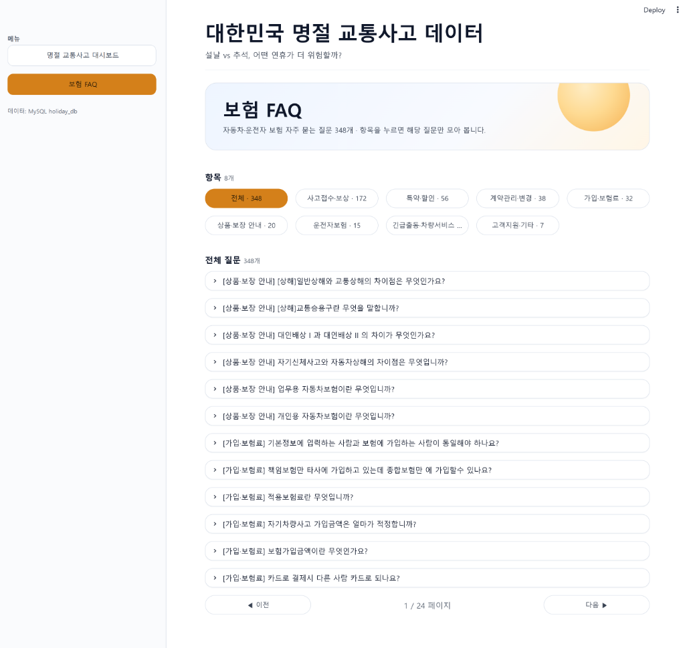

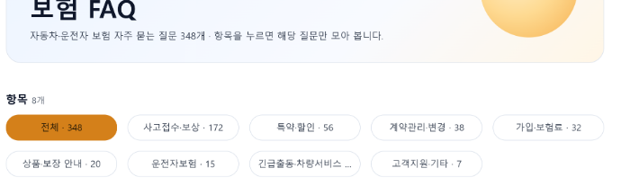

주요 사용 시나리오: 연휴 사고 관련 보상 절차·특약·자기부담금 같은 궁금증을 대시보드 안에서 바로 확인합니다. FAQ는 보험사 고객센터 안내문을 정리한 참고 자료이며, 법적 판단의 근거는 아닙니다.

## 10. 구현 화면과 기능

### 10.1 전체 비교 탭

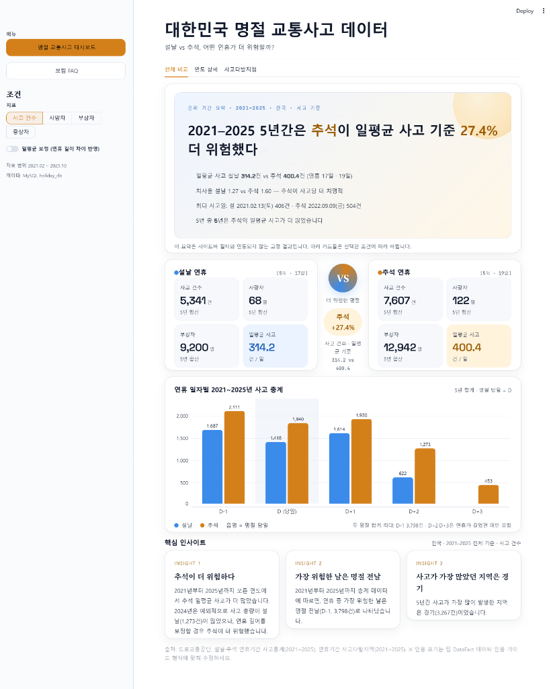

#### (1) 명절 교통사고 대시보드 — 전체 현황

필터와 무관하게 항상 전국·전체 기간·사고 기준으로 같은 결과를 보여주는 고정 요약 카드입니다. 화면 조건에 따라 결론이 흔들리지 않게 하려고 일부러 연동하지 않았습니다.

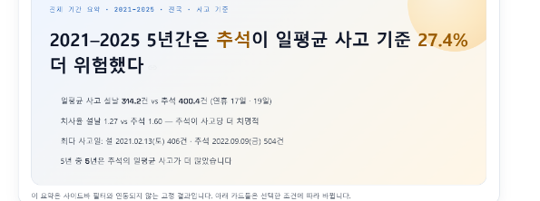

| 요약 항목 | 값 |
|---|---|
| 기간 | 2021-2025 (5년, 36일) |
| 결론 | 추석이 일평균 사고 기준 27.4% 더 위험 |
| 일평균 사고 | 설날 314.2건 vs 추석 400.4건 (연휴 17일 · 19일) |
| 치사율 | 설날 1.27 vs 추석 1.60 — 추석이 사고당 더 치명적 |
| 최다 사고일 | 설 2021.02.13(토) 406건 · 추석 2022.09.09(금) 504건 |
| 추석 우세 | 5년 중 5년 추석의 일평균 사고가 더 많음 |

#### (2) 사고 건수 · 사망자 · 부상자 · 중상자 별 "설날 연휴 VS 추석 연휴" 비교

왼쪽 설날 카드 / 가운데 VS / 오른쪽 추석 카드 3단 배치입니다. 각 카드 상단에는 연휴 횟수와 일수(`5회 · 17일`), 하단에는 사고·사망·부상 KPI와 일평균 사고를 배치했습니다. 사이드바 지표를 바꾸면 강조 지표가 함께 바뀌고, 연도 상세 탭에서 연도를 고르면 각 KPI에 전년 대비 증감이 붙습니다.

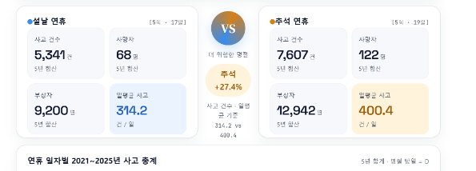

| 지표 (5년 합계) | 설날 (5회 · 17일) | 추석 (5회 · 19일) |
|---|---|---|
| 사고 건수 | 5,341건 | 7,607건 |
| 사망자 | 68명 | 122명 |
| 부상자 | 9,200명 | 12,942명 |
| 일평균 사고 | 314.2건/일 | 400.4건/일 |

가운데 VS 카드는 두 명절의 일평균 사고 차이를 `추석 +27.4%`처럼 한 줄로 요약해, 숫자를 읽지 않아도 결론이 보이게 했습니다.

#### (3) 연휴 일자별 5년 총계

명절 당일을 D로 두고 D-1 \~ D+3 구간의 5년 합계 사고를 설날·추석 묶음 막대로 비교합니다. 음영 처리한 구간이 명절 당일입니다.

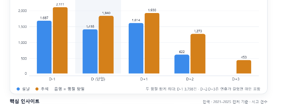

| 구간 | 설날 | 추석 | 합계 |
|---|---|---|---|
| D-1 | 1,607건 | 2,111건 | 3,798건 |
| D (당일) | 1,418건 | 1,840건 | 3,258건 |
| D+1 | 1,614건 | 1,930건 | 3,544건 |
| D+2 | 622건 | 1,273건 | 1,895건 |
| D+3 | 0건 | 453건 | 453건 |

두 명절을 합치면 **가장 위험한 날은 명절 전날(D-1, 3,798건)** 입니다. D+2·D+3은 연휴가 길었던 해에만 날짜가 존재하므로(설날은 D+3 없음) 건수 비교 시 주의가 필요합니다.

#### (4) 일평균 보정 (연휴 길이 차이 반영)

연휴 길이는 해마다 3\~5일로 다릅니다. 설날 17일 · 추석 19일처럼 총 일수가 다르면 합계만으로는 위험도를 비교할 수 없습니다. 사이드바의 `일평균 보정` 토글을 켜면 화면의 모든 수치가 `합계 ÷ 연휴일수`로 바뀌고, KPI 숫자는 소수점 한 자리로 표시되며, 전년 대비 비교 기준도 일평균으로 통일됩니다.

- 계산식: `요약.일평균 = 지표 합계 ÷ 연휴 일수` (예: 설날 사고 5,341 ÷ 17일 = 314.2건/일)
- 토글을 켜면 KPI 부제가 `5년 합산 · 일평균`으로 바뀌어 현재 기준을 알려 줍니다.
- 실제로 이 보정이 판정을 뒤집는 해가 있습니다. 2024년은 사고 총량이 설날(1,273건)이 더 많았지만, 연휴 길이를 보정하면 추석이 더 위험했습니다.

#### (5) 핵심 인사이트

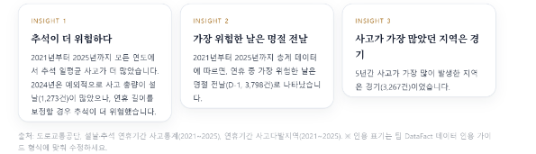

1. 추석이 더 위험하다 — 2021년부터 2025년까지 모든 연도에서 추석 일평균 사고가 더 많았습니다.
2. 가장 위험한 날은 명절 전날 — 5년 총계 기준 D-1이 3,798건으로 가장 많았습니다.
3. 사고가 가장 많았던 지역은 경기 — 5년간 3,267건입니다.

### 10.2 연도 상세 탭

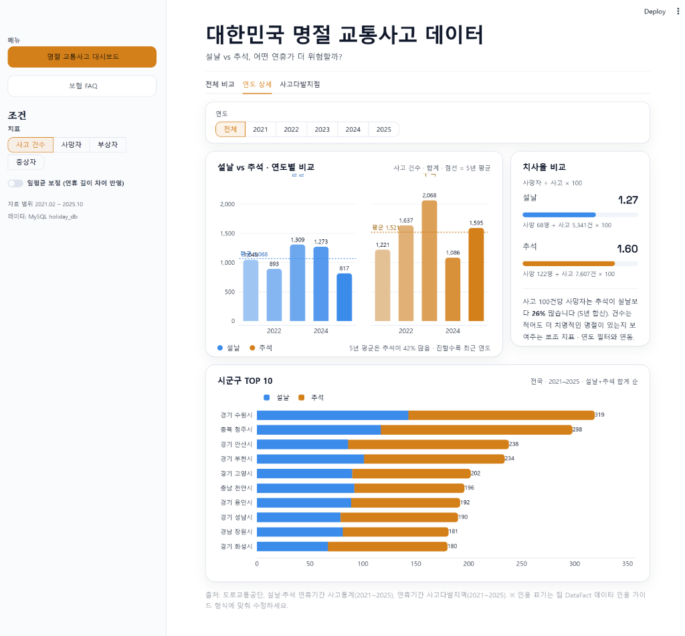

#### (1) 연도 필터

탭 상단에 `전체 / 2021 / 2022 / 2023 / 2024 / 2025` 선택 버튼이 있습니다. 여기서 고른 연도는 이 탭의 모든 카드에 적용되고, `전체`를 고르면 5년 합산으로 돌아갑니다.

#### (2) 설날 VS 추석 연도별 비교

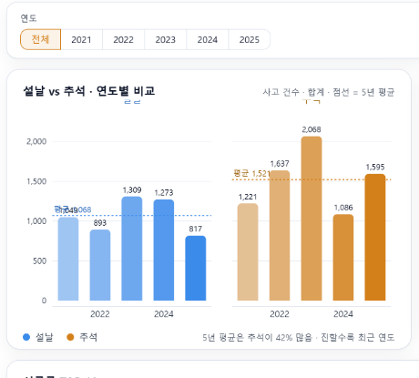

설날과 추석을 좌우 두 묶음으로 나누고, 각 묶음 안에 연도별 막대를 세웠습니다. 점선은 5년 평균입니다.

| 연도 | 설날 | 추석 |
|---|---|---|
| 2021 | 1,049건 | 1,221건 |
| 2022 | 893건 | 1,637건 |
| 2023 | 1,309건 | 2,068건 |
| 2024 | 1,273건 | 1,086건 |
| 2025 | 817건 | 1,595건 |
| 5년 평균 | 1,068건 | 1,521건 |

5년 평균은 추석이 설날보다 42% 많습니다. 막대가 진할수록 최근 연도이며, 이 차트에서 2024년만 설날이 추석을 앞선 것을 눈으로 확인할 수 있습니다.

#### (3) 치사율 비교

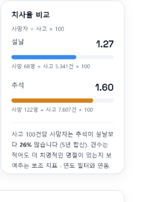

건수만 보면 추석이 많지만, 사고당 치명도는 별개 문제입니다. 치사율은 `사망자 ÷ 사고 × 100`으로 계산합니다.

| 명절 | 치사율 | 계산 |
|---|---|---|
| 설날 | 1.27 | 68명 ÷ 5,341건 × 100 |
| 추석 | 1.60 | 122명 ÷ 7,607건 × 100 |

사고 100건당 사망자는 추석이 설날보다 26% 많습니다. 건수는 적어도 더 치명적인 명절이 있는지 보여주는 보조 지표이며, 연도 필터와 연동됩니다.

#### (4) 시군구 TOP 10

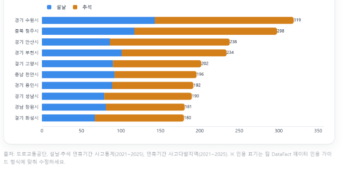

전국 기준 연휴 사고가 많은 시군구 10곳입니다. 설날(파랑)과 추석(주황)을 쌓아 올려 어느 명절에 사고가 몰렸는지 함께 보이게 했습니다.

| 순위 | 시군구 | 사고 건수 |
|---|---|---|
| 1 | 경기 수원시 | 319건 |
| 2 | 충북 청주시 | 298건 |
| 3 | 경기 안산시 | 238건 |
| 4 | 경기 부천시 | 234건 |
| 5 | 경기 고양시 | 202건 |
| 6 | 충남 천안시 | 196건 |
| 7 | 경기 용인시 | 192건 |
| 8 | 경기 성남시 | 190건 |
| 9 | 경남 창원시 | 181건 |
| 10 | 경기 화성시 | 180건 |

상위 10곳 중 7곳이 경기·인천 권역으로, 수도권에 사고가 집중되는 경향을 보여 줍니다.

### 10.3 사고다발지점 탭

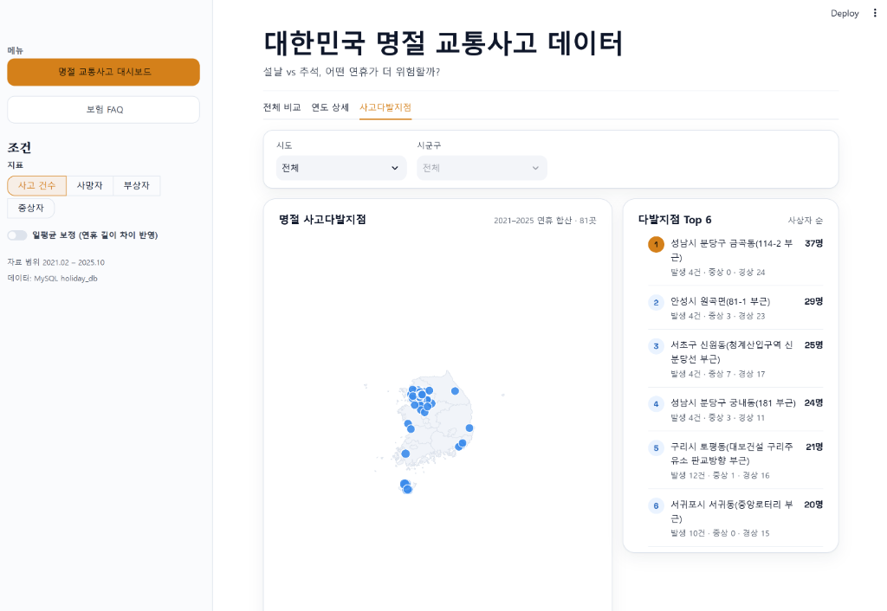

#### (1) 시도 / 시군구 필터

`시도`를 먼저 고르면 `시군구` 목록이 그 시도에 속한 지역으로 좁혀지고, 시도가 `전체`일 때는 시군구 선택이 잠깁니다. 지역을 좁히면 지도·Top 6·전체 목록이 모두 함께 걸러집니다.

#### (2) 명절 사고다발지점

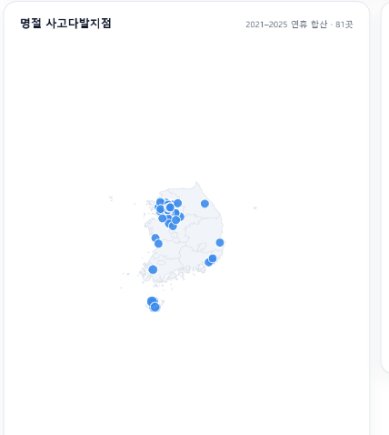

- 범위: 2021\~2025 연휴 합산 · 81곳
- 시도 경계 GeoJSON을 배경으로 깔고, 다발지점을 좌표에 점으로 찍었습니다.
- 점을 누르면 지점명과 사고·사상자 정보가 뜹니다.
- 이 탭의 데이터는 5년 묶음 자료라 연도·명절 구분이 없습니다(`HOTSPOT_PERIOD = "2021~2025"`).

#### (3) 다발지점 TOP 6

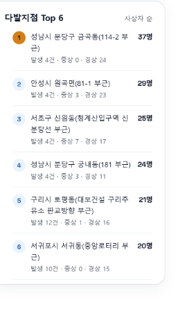

사상자 순 정렬입니다. 사고 건수가 아니라 사상자 기준인 이유는, 사고 4건에 사상자 37명이 나온 지점이 사고 12건에 21명이 나온 지점보다 위험하다고 보기 때문입니다.

| 순위 | 지점 | 사상자 | 발생 · 중상 · 경상 |
|---|---|---|---|
| 1 | 성남시 분당구 금곡동(114-2 부근) | 37명 | 발생 4건 · 중상 0 · 경상 24 |
| 2 | 안성시 원곡면(81-1 부근) | 29명 | 발생 4건 · 중상 3 · 경상 23 |
| 3 | 서초구 신원동(청계산입구역 신분당선 부근) | 25명 | 발생 4건 · 중상 7 · 경상 17 |
| 4 | 성남시 분당구 궁내동(181 부근) | 24명 | 발생 4건 · 중상 3 · 경상 11 |
| 5 | 구리시 토평동(대보건설 구리주유소 판교방향 부근) | 21명 | 발생 12건 · 중상 1 · 경상 16 |
| 6 | 서귀포시 서귀동(중앙로터리 부근) | 20명 | 발생 10건 · 중상 0 · 경상 15 |

그 아래에 전체 목록 카드가 있어, 필터에 걸린 81곳(또는 지역 필터 결과)을 표로 모두 확인할 수 있습니다.

## 11. 회고록

프로젝트를 마치고 팀원 다섯 명이 각자 자기 담당 범위를 기준으로 쓴 회고입니다. 문체와 구성은 각자 다르게 두었습니다.

### 문진호 · 팀장 / 화면 설계·구현

화면을 만드는 일은 결국 "무엇을 먼저 보여줄지"를 정하는 일이었습니다. 사고 건수·사망자·부상자·중상자 네 지표와 일평균 보정 토글은 모든 탭에 영향을 주니 사이드바에 두고, 연도와 시도·시군구는 특정 탭에서만 쓰이니 탭 안으로 넣었습니다. 그래서 "전체 비교" 탭은 조건이 바뀌어도 5년 요약을 그대로 보여주는 고정 화면이 됐고, 발표 중에 화면을 헤맬 일이 없었습니다.

**남은 것**

- 일평균 보정은 카드마다 따로 만들지 않고 계산 지점 한 곳에서 처리했습니다. 토글 하나로 요약 배너·KPI·차트·인사이트 문장이 같은 기준으로 움직입니다.
- 3탭(전체 비교 · 연도 상세 · 사고다발지점)과 별도 페이지(보험 FAQ)를 `session_state["page"]`로 갈라, 탭 화면과 FAQ 화면의 역할을 섞지 않았습니다.

**아쉬운 것**

- 처음에는 카드마다 데이터를 다시 읽게 짰습니다. 카드가 늘수록 느려져서 뒤늦게 조회 지점을 한 곳으로 모았습니다.
- theme.py를 전달본에서 빠뜨렸습니다. 저장소에 이 파일이 없으면 앱이 아예 뜨지 않습니다.
- db_config.py에 비밀번호가 그대로 적혀 있습니다. 공개 저장소에 올릴 때는 반드시 빼야 합니다.

**다시 한다면**

카드 순서를 코드로 옮기기 전에 확정하고, 접속 정보는 처음부터 환경변수로 빼겠습니다.

### 국경민 · 기획

기획에서 제일 오래 고민한 건 "무엇을 비교할 것인가"였습니다. 설날과 추석 사고 자료는 각각 있었지만 한 화면에서 같은 기준으로 견준 화면은 없었습니다. 그래서 주제를 "자료가 없다"가 아니라 "같은 축으로 비교한 적이 없다"로 잡았습니다.

**판단한 것**

- 일평균을 결론 지표로 삼았습니다. 설날 17일·추석 19일이라 합계는 구조적으로 추석이 커집니다. 일평균으로 맞추면 설날 314.2건/일, 추석 400.4건/일로 추석이 27.4% 높습니다.
- 건수와 치명도를 분리해 치사율(사망÷사고)을 별도 지표로 요구했습니다. 추석 1.60 vs 설날 1.27 — 건수와 별개로 사고당 치명도도 추석이 높습니다.
- 출처 표기 규칙을 화면 캡션까지 내려보냈습니다. 숫자를 인용할 때 근거가 함께 보여야 한다고 봤습니다.

**놓친 것**

- 요구사항을 문서로 먼저 잠그지 않아 화면 순서와 카드 구성이 개발 중에 두 번 바뀌었습니다.
- 데이터 정의서를 늦게 확정해, 수집된 차량 등록 데이터를 어느 화면에 붙일지 끝내 정하지 못했습니다.

**다음 기준**

화면설계서를 착수 전에 버전으로 고정하고, 모든 데이터에 "어느 화면에 쓸 것인지"를 수집 전에 적어 두겠습니다.

### 김신형 · 데이터 수집 (사고통계)

숫자를 다루는 일이라 확인에 시간을 많이 썼습니다. 전국·시도·시군구를 각각 다른 표로 두지 않고 `level` 컬럼 하나로 구분해 한 테이블에 담았습니다(accident_daily 8,901행). 화면에서 집계 단위를 골라 쓸 수 있게 되면서 지역 필터와 전국 요약을 같은 데이터로 처리할 수 있었습니다.

**확인한 것**

- 반복 적재에도 값이 늘지 않도록 UNIQUE (acc_date, holiday, sido, sigungu)를 걸었습니다.
- 시도 소계와 시군구 합계가 전국 합계와 모두 일치했습니다. 사고 12,948 = 12,948, 사망 190 = 190, 중상 3,710, 부상 22,142.
- 상하위가 맞아떨어지니 이중계상이나 누락은 없다고 말할 수 있었습니다.

**어긋났던 것**

처음 시도별 합계를 뽑았을 때 14개 시도만 잡혀 전국과 548건이 어긋났습니다. 세종·울산·제주가 빠진 540건과 충남 차이 8건이 원인이었고, 원본과 다시 대조하고 나서야 맞췄습니다.

**다음엔**

수집 단계에서 지역명과 함께 행정구역 코드를 넣어 이름 표기가 달라도 조인되게 하고, 적재 직후 검증 쿼리를 자동으로 돌려 합계 비교표를 남기겠습니다.

### 윤혜정 · 데이터 수집 (사고다발지역·FAQ)

수집은 모으는 일보다 이름을 맞추는 일이 오래 걸렸습니다. 다발지점은 지점명·좌표·사고·사상자·사망·중상·경상·부상신고를 한 행에 담아 지도와 TOP 목록을 같은 데이터로 만들었습니다. 성남시 분당구 금곡동(사상자 37명·4건), 안성시 원곡면(29명·4건), 서초구 신원동(25명·4건)처럼 지점 단위 결론이 나왔습니다.

**모은 것**

- 원본 시군구 표기를 고치지 않고 `sigungu_base`를 따로 두었습니다. 원본을 훼손하면 출처 대조가 안 되고, 그대로 두면 사고통계와 조인이 안 맞는 상황이라 두 컬럼으로 나눴습니다.
- FAQ 348건을 4개 보험사(AXA 157, 삼성화재 114, 하나손해보험 41, KB손해보험 36)와 8개 항목으로 정리했습니다. 빈 질문·빈 답변은 0건입니다.

**다시 볼 것**

처음 정리한 문서에는 보험사가 3곳으로 적혀 있었는데, 실제로 세어보니 KB손해보험이 36건 있었습니다. 중간 점검에서 찾아 정정했지만 먼저 세어봤다면 문서를 다시 고칠 일이 없었습니다. FAQ 출처가 답변 본문 끝에 섞여 있어 떼어내는 작업도 손이 많이 갔습니다.

**습관으로 남길 것**

크롤링할 때 출처를 처음부터 별도 컬럼으로 받고, 수집 직후 건수와 출처 분포를 뽑아 문서와 바로 대조하겠습니다.

### 전윤호 · 데이터 수집 (FAQ 전처리·보조 데이터)

전처리는 눈에 잘 안 보이는 일이라 결과를 믿게 만드는 게 어려웠습니다.

**손본 것**

- 크롤링한 FAQ 답변에 `& #39;` 같은 깨진 HTML 엔티티가 섞여 있었습니다. 전부 지우면 원문이 훼손되니 깨진 형태만 골라 복원했습니다.
- 답변 끝 `(출처 : 보험사)` 표기를 정규식으로 떼어내 별도 컬럼(source)으로 분리했습니다. 화면에서 출처를 배지로 보여줄 수 있고 항목별·보험사별 건수도 셀 수 있게 됐습니다.
- MySQL이 안 될 때를 대비한 CSV 폴백 경로를 직접 꺼보며 점검했습니다. 연결이 실패하면 사유를 사이드바에 띄우고 화면은 그대로 뜹니다.

**못 붙인 것**

맡았던 보조 데이터(차량 등록·이륜차)는 최종 테이블 5개에 들어가지 못했습니다. 사고통계와 기간 기준이 맞지 않았고 정규화 기준도 마지막까지 정하지 못했습니다. 버린 데이터는 아니지만 화면에 닿지 못한 것은 사실입니다. 전처리 결과를 검사 스크립트로 남기지 않고 눈으로만 확인한 것도 아쉽습니다.

**다음 규칙**

수집 전에 "이 데이터가 어느 화면에 붙는지"를 먼저 적고, 붙일 곳이 없으면 모으지 않겠습니다.

### 팀 전체 회고

**Keep**

- 화면 1명·데이터 3명·기획 1명으로 역할을 나눈 게 잘 맞았습니다. 데이터 수집이 병렬로 돌면서 화면 작업이 멈추지 않았습니다.
- "추석이 일평균 사고 기준 27.4% 더 위험하다"는 한 줄 결론을 끝까지 유지했습니다. 카드가 늘어나도 결론이 흔들리지 않게 고정 요약 카드를 따로 둔 것이 주효했습니다.
- 숫자를 화면에 쓰기 전에 합계 검증을 거쳤습니다. 발표에서 "이 숫자 맞냐"는 질문에 바로 답할 수 있었던 건 이 절차 덕분입니다.

**Problem**

- 요구사항 확정이 늦어 화면 순서가 두 번 바뀌었습니다. 구현 인력이 한 명뿐이라 변경 비용이 컸습니다.
- theme.py 미포함, db_config.py 비밀번호 하드코딩처럼 저장소 위생 문제가 마지막에 드러났습니다.
- 수집한 차량 등록 데이터가 끝내 화면에 붙지 못했습니다.

**Try**

1. 착수 전에 화면설계서와 데이터 정의서를 버전으로 고정하고, 변경은 추가 요청으로만 받기.
2. 공개 저장소 규칙을 첫날 정하기(비밀번호·미포함 파일 점검표).
3. 데이터를 모으기 전에 "어느 화면에 붙일 것인가"를 먼저 적기.

**프로젝트 총평**

짧은 기간에 8,901행 사고통계, 81곳 다발지점, 348건 FAQ를 한 화면에 담고, 5년 전 기간을 같은 기준으로 비교하는 결론까지 만들었습니다. 화면이 화려해서가 아니라 결론이 한 줄로 정리된다는 점이 이 프로젝트의 성과라고 생각합니다.
