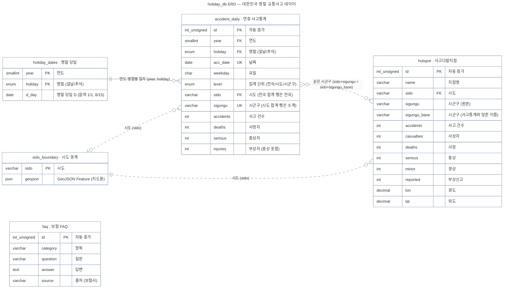

# 대한민국 명절 교통사고 데이터 — 설날 vs 추석, 어떤 연휴가 더 위험할까?

> Streamlit + MySQL 기반 명절 연휴 교통사고 분석 대시보드
> 설날·추석 연휴기간 사고통계(2021~2025)와 연휴기간 사고다발지역(2021~2025)을 한 화면에서 비교합니다.

SKN37기 4조 · 팀 프로젝트

## 목차

1. [프로젝트 개요](#1-프로젝트-개요)
2. [프로젝트 기간](#2-프로젝트-기간)
3. [프로젝트 팀 및 역할](#3-프로젝트-팀-및-역할)
4. [기술 스택](#4-기술-스택)
5. [필수 라이브러리](#5-필수-라이브러리)
6. [데이터베이스 설계문서 ERD](#6-데이터베이스-설계문서-erd)
7. [수집 데이터](#7-수집-데이터)
8. [데이터 조회 프로그램 화면설계서](#8-데이터-조회-프로그램-화면설계서)
9. [FAQ 조회 시스템](#9-faq-조회-시스템)
10. [구현 화면과 기능](#10-구현-화면과-기능)
    - [10.1 전체 비교 탭](#101-전체-비교-탭)
    - [10.2 연도 상세 탭](#102-연도-상세-탭)
    - [10.3 사고다발지점 탭](#103-사고다발지점-탭)
11. [실행 방법](#11-실행-방법)
12. [데이터 해석 주의사항](#12-데이터-해석-주의사항)
13. [향후 계획](#13-향후-계획)

---

## 1. 프로젝트 개요

명절 연휴에는 이동이 한꺼번에 몰리면서 교통사고가 집중됩니다. 이 프로젝트는 "설날과 추석 중 어느 쪽이 더 위험한가"를 같은 축에서 데이터로 비교합니다.

- 목표: 설날·추석 연휴의 사고 건수·사망자·부상자·중상자를 같은 기준으로 비교하고, 위험한 날짜와 지역을 함께 제시합니다.
- 범위: 2021~2025년 연휴 10회, 총 36일 (설날 17일 + 추석 19일) · 사고 12,948건 · 사망 190명 · 부상 22,142명
- 결론: **추석이 일평균 사고 기준 27.4% 더 위험** (설날 314.2건/일 vs 추석 400.4건/일)

## 2. 프로젝트 기간

| 구분 | 기간 |
|---|---|
| 프로젝트 시작 | 2026-09-27 (일) |
| 프로젝트 마감 | 2026-09-28 (월) |
| 총 기간 | 2일 |

## 3. 프로젝트 팀 및 역할

SKN37기 4조

| 이름 | 역할 | 담당 |
|---|---|---|
| 문진호 | 팀장 / 화면 설계·구현 | Streamlit 화면 구성, 카드·차트 구현, 데이터 연동, 최종 발표 |
| 국경민 | 기획 | 주제 선정과 범위 정의, 데이터 정의서·화면 시나리오, 데이터 활용 기준 판단 |
| 김신형 | 데이터 수집 | 연휴 사고통계 수집·정제, 데이터 검증 |
| 윤혜정 | 데이터 수집 | 사고다발지역 수집, FAQ 크롤링·정제 |
| 전윤호 | 데이터 수집 | 차량 등록·이륜차 데이터 수집, FAQ 전처리 |

<!-- 담당자별 세부 업무 범위는 팀 확정 후 수정하세요. -->

## 4. 기술 스택

| 구분 | 사용 기술 |
|---|---|
| 언어 | Python 3.10+ (PEP 604 타입 힌트 `dict \| None` 사용) |
| 웹 화면 | Streamlit (`st.tabs`, `st.segmented_control`, `st.toggle`, `st.cache_data`) |
| 데이터 처리 | pandas |
| 시각화 | Plotly (`graph_objects`, `make_subplots`), 한국 행정구역 경계 GeoJSON |
| 데이터베이스 | MySQL 5.7 이상 (JSON 타입 사용), InnoDB · utf8mb4 / utf8mb4_unicode_ci |
| DB 접속 | PyMySQL |
| 개발 환경 | VS Code, Git / GitHub |

## 5. 필수 라이브러리

`requirements.txt` 기준입니다. (아래 목록은 업로드된 소스의 `import` 문에서 확인한 것입니다.)

| 라이브러리 | 용도 | 사용 위치 |
|---|---|---|
| streamlit | 화면·탭·필터 위젯 | app.py, sections.py, faq.py |
| pandas | CSV/DB 표 처리, 집계 | analysis.py, data_source.py, sections.py, faq.py |
| plotly | 막대·꺾은선·지도 차트 | sections.py |
| pymysql | MySQL 연결 (순수 파이썬 드라이버) | data_source.py |

```text
streamlit>=1.40
pandas
plotly
pymysql
```

- `st.segmented_control` · `st.toggle`을 쓰므로 **Streamlit 1.40 이상**이 필요합니다.
- Python 표준 라이브러리만 사용하는 모듈: `json`, `dataclasses`, `pathlib`, `html`, `re`
- 프로젝트에는 위 4개 외에 `analysis.py`(계산), `sections.py`(화면 카드), `theme.py`(색·CSS), `faq.py`(FAQ 화면), `data_source.py`(데이터 로딩), `db_config.py`(접속 정보) 모듈이 함께 있습니다.
- `theme.py`는 화면 색·글꼴·CSS(`T.CSS`, `T.FAQ_CSS`, `T.COLORS`, `T.TINTS`, `T.MUTED`)을 담당합니다. **이번 전달본에는 포함되지 않았으므로 저장소에 반드시 함께 올려야 실행됩니다.**

## 6. 데이터베이스 설계문서 ERD

`db/holiday_db.sql`(MySQL Workbench에서 실행)로 만들어지는 스키마입니다. 테이블 5개 + 뷰 3개로 구성되며, 물리 외래키(FK) 없이 `year`·`holiday`·`sido`·`sigungu` 값으로 논리 조인합니다.


<details>
<summary>Mermaid 원문 펼치기 (db/holiday_db_erd.mmd — 첨부본 그대로)</summary>



</details>

### 6.1 테이블 설명

| 테이블 | 행 수 | 설명 | 주요 키·제약 |
|---|---|---|---|
| accident_daily | 8,901 | 연휴 날짜 × 지역별 사고통계. `level`로 전국(36행)·시도(612행)·시군구(8,253행)를 구분 | PK `id`, UNIQUE `(acc_date, holiday, sido, sigungu)`, INDEX `(year, holiday, level)` |
| holiday_dates | 10 | 연도·명절별 명절 당일. 일자별 D(-1, 0, +1…) 계산 기준 | PK `(year, holiday)` |
| hotspot | 81 | 연휴기간 사고다발지역(2021~2025 합산, 5년 묶음). 좌표 포함 | PK `id`, INDEX `(sido, sigungu_base)` |
| sido_boundary | 17 | 시도 경계 GeoJSON. 지도 배경용 | PK `sido` |
| faq | 348 | 보험 FAQ. 답변 끝의 `(출처 : 보험사)`를 별도 컬럼으로 분리 | PK `id`, INDEX `category`, `source` |

### 6.2 뷰 설명

| 뷰 | 내용 | 사용 화면 |
|---|---|---|
| v_holiday_totals | 연도·명절별 전국 합계, 연휴일수, 일평균 사고, 치사율 | 요약·비교 카드 |
| v_sido_totals | 연도·명절·시도별 합계 | 지역 비교 |
| v_daily_d | 전국 일자별 수치 + `DATEDIFF`로 계산한 D 오프셋 | 연휴 일자별 추이 차트 |

### 6.3 설계 포인트

1. `level` 컬럼 하나로 전국 합계·시도 소계·시군구 원자료를 한 테이블에 담아, 화면에서 집계 단위를 골라 쓸 수 있게 했습니다.
2. `injuries`(부상자)에 `serious`(중상자)가 **포함**되어 있습니다. 부상과 중상을 더하면 이중계상이므로 화면에서도 합산하지 않습니다.
3. `hotspot`에 `sigungu`(원본 표기)와 `sigungu_base`(사고통계와 맞춘 이름)를 따로 두어, 원본을 훼손하지 않고 조인만 정합하게 맞췄습니다.
4. 데이터 중복 적재를 막으려고 `accident_daily`에 `UNIQUE (acc_date, holiday, sido, sigungu)`를 걸었습니다.
5. 스크립트는 `DROP TABLE`/`DROP VIEW` 후 다시 만들기 때문에 몇 번을 실행해도 같은 상태가 됩니다.

## 7. 수집 데이터

### 7.1 수집 데이터 목록

| 구분 | 데이터 | 형식 | 규모 | 활용 |
|---|---|---|---|---|
| 사고통계 | 설날·추석 연휴기간 사고통계(2021~2025) | CSV → 테이블 | 8,901행 | 대시보드 전체 |
| 명절 기준일 | 연도·명절별 명절 당일 | 테이블 | 10행 | D-day 계산 |
| 사고다발지역 | 연휴기간 사고다발지역(2021~2025) | CSV → 테이블 | 81곳 | 사고다발지점 탭 |
| 지도 경계 | 시도 경계 GeoJSON | JSON → 테이블 | 17개 | 지도 배경 |
| FAQ | 보험사 자동차·운전자 보험 FAQ | 크롤링 CSV → 테이블 | 348건 | 보험 FAQ 화면 |
| 참고 | 데이터 인용 가이드(DataFact) | 링크 | 1건 | 출처 표기 형식 |

### 7.2 데이터 출처

| 데이터 | 출처 |
|---|---|
| 설날·추석 연휴기간 사고통계(2021~2025) | 도로교통공단 (TAAS, https://taas.koroad.or.kr/) |
| 연휴기간 사고다발지역(2021~2025) | 도로교통공단 |
| 보험 FAQ | AXA · 삼성화재 · 하나손해보험 · KB손해보험 고객센터 FAQ |
| 인용 표기 형식 | 팀 DataFact 데이터 인용 가이드 |

출처 표기는 화면 하단 캡션에 함께 넣었습니다: "출처: 도로교통공단, 설날·추석 연휴기간 사고통계(2021~2025), 연휴기간 사고다발지역(2021~2025)."

### 7.3 어떻게 수집했는지

| 데이터 | 수집 방법 | 비고 |
|---|---|---|
| 사고통계 | 도로교통공단 설날·추석 연휴기간 사고통계를 연도별로 내려받아 연도·명절·날짜·시도·시군구 단위로 정리 | 지역 필터용 전국/시도/시군구 3계층 행(`level`) 생성, 연휴 일수 보정용 날짜별 행 유지 |
| 명절 기준일 | 음력 1월 1일·8월 15일에 해당하는 양력 날짜를 연도별로 정리해 `holiday_dates`에 적재 | 연휴 일자를 D-1/D/D+1로 나누는 기준 |
| 사고다발지역 | 연휴기간 사고다발지역 5년 묶음 자료에서 지점명·좌표·사고·사상자·사망·중상·경상·부상신고를 수집 | 원본 시군구 표기 유지 + 사고통계와 맞춘 `sigungu_base` 별도 관리 |
| 보험 FAQ | 보험사 고객센터 FAQ를 크롤링해 `항목 / 질문 / 답변 / 출처` 4개 컬럼으로 정리 | 답변 끝 `(출처 : 보험사)`를 정규식으로 분리, 깨진 HTML 엔티티(예: `& #39;` 형태)만 복원 |
| DB 적재 | `db/build_mysql.py`가 `data/` 폴더를 읽어 `db/holiday_db.sql` 생성 → Workbench에서 실행 | DB·테이블·데이터·뷰를 한 번에 생성 |
| 폴백 구조 | MySQL 연결 실패 시 `data/` 폴더 CSV로 자동 전환하고 사이드바에 사유 표시 | 시연 중 DB 장애에도 화면이 멈추지 않게 한 장치 |

### 7.4 데이터 활용 검증 (DB 적재 후 재계산)

| 검증 항목 | 결과 |
|---|---|
| 사고 합계 | 12,948건 (대시보드 표시값과 일치) |
| 사망 / 중상 / 부상 | 190명 / 3,710명 / 22,142명 (일치) |
| 시도 소계 합계 = 전국 합계 | 사고 12,948 = 12,948, 사망 190 = 190 (일치) |
| 시군구 합계 = 전국 합계 | 사고 12,948 = 12,948 (일치) |

상하위 집계가 모두 맞아떨어져 이중계상·누락이 없습니다.

### 7.5 FAQ 데이터 구성

| 출처 | 건수 |
|---|---|
| AXA | 157 |
| 삼성화재 | 114 |
| 하나손해보험 | 41 |
| KB손해보험 | 36 |
| 합계 | 348 |

항목 8종: 사고접수·보상 172, 특약·할인 56, 계약관리·변경 38, 가입·보험료 32, 상품·보장 안내 20, 운전자보험 15, 긴급출동·차량서비스 8, 고객지원·기타 7 (빈 질문·빈 답변 0건)

## 8. 데이터 조회 프로그램 화면설계서

### 8.1 전체 레이아웃

```text
┌──────────────┬──────────────────────────────────────────────────────┐
│  사이드바     │  사이트 제목   대한민국 명절 교통사고 데이터           │
│              │               설날 vs 추석, 어떤 연휴가 더 위험할까?    │
│  메뉴         │                                                      │
│   · 명절 교통사고 대시보드 │  [ 탭 ]  전체 비교 │ 연도 상세 │ 사고다발지점 │
│   · 보험 FAQ  │                                                      │
│              │  (탭 내용)                                            │
│  조건         │                                                      │
│   · 지표 4종   │                                                      │
│   · 일평균 보정│                                                      │
│              │                                                      │
│  자료 범위    │  출처 캡션 (도로교통공단 …)                            │
│  데이터: MySQL holiday_db                                             │
└──────────────┴──────────────────────────────────────────────────────┘
```

### 8.2 사이드바 사양

| 영역 | 요소 | 동작 |
|---|---|---|
| 메뉴 | `명절 교통사고 대시보드` / `보험 FAQ` 버튼 | 선택한 페이지만 표시 (session_state `page`) |
| 조건 - 지표 | 사고 건수 / 사망자 / 부상자 / 중상자 (segmented control) | 모든 탭의 막대·수치 기준을 바꿈 |
| 조건 - 일평균 보정 | 토글 (기본 꺼짐) | 켜면 합계 대신 **일평균**으로 표시 (연휴 길이 차이 제거) |
| 안내 | 자료 범위 (2021.02 ~ 2025.10) | 데이터에서 자동 계산 |
| 안내 | 데이터 출처 표기 | MySQL 연결 성공 시 `데이터: MySQL holiday_db`, 실패 시 경고와 함께 CSV 사용 |

### 8.3 탭별 화면 설계

| 탭 | 필터 위치 | 카드 구성 |
|---|---|---|
| 전체 비교 | 없음 (5년 합계 고정) | 고정 요약 → 설날 KPI / VS / 추석 KPI → 연휴 일자별 5년 총계 → 핵심 인사이트 3개 |
| 연도 상세 | 탭 안에 연도 선택 | 설날 vs 추석 연도별 비교 + 치사율 비교 → 시군구 TOP 10 |
| 사고다발지점 | 탭 안에 시도·시군구 선택 | 명절 사고다발지점 지도 + 다발지점 TOP 6 → 전체 목록 |

설계 의도: 필터를 사이드바(전체 공통)와 탭 안(탭 전용)으로 나눴습니다. 지표·일평균 보정은 모든 화면에 영향을 주므로 사이드바에, 연도와 지역은 특정 탭에서만 쓰이므로 탭 안에 두었습니다. 그 결과 "전체 비교" 탭은 항상 5년 요약을 보여주는 고정 화면으로 유지됩니다.

## 9. FAQ 조회 시스템

- 화면: 보험 FAQ (사이드바 메뉴에서 별도 페이지로 진입, 탭이 아님)
- 데이터: `faq` 테이블 348건 (DB 연결 실패 시 `data/faq/insurance_faq.csv`)
- 구성: 제목 배너 → 항목 버튼(전체 + 8개 항목, 건수 표시) → 질문 목록(펼침) → 페이지 넘김


주요 사용 시나리오: 연휴 사고 관련 보상 절차·특약·자기부담금 같은 궁금증을 대시보드 안에서 바로 확인합니다. FAQ는 보험사 고객센터 안내문을 정리한 참고 자료이며, 법적 판단의 근거는 아닙니다.


문의: SKN37기 4조 (팀장 문진호)
